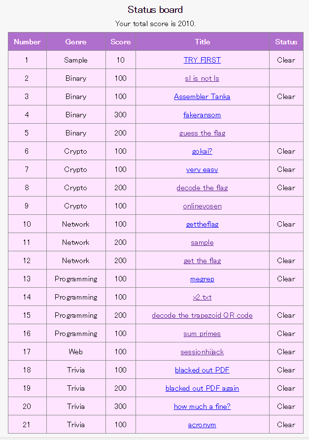

# サイバー甲子園(2016)-WriteUp-

`BiPhone`というチームで`snow`と一緒に出場した

結果４位だった

## WriteUp

|Number|Genre|Score|Title|Status|
|:-----|:----|:----|:----|:-----|
|1|Sample|10pt|[TRY FIRST](q1/q1.md)|O|
|2|Binary|100pt|[sl is not ls ](q2/q2.md)|O|
|3|Binary|100pt|[Assembler Tanka](q3/q3.md)||
|4|Binary|300pt|[fakeransom](q4/q4.md)||
|5|Binary|200pt|[guess the flag](q5/q5.md)|O|
|6|Crypto|100pt|[gokai?](q6/q6.md)|O|
|7|Crypto|100pt|[very easy](q7/q7.md)|O|
|8|Crypto|200pt|[decode the flag](q8/q8.md)|O|
|9|Crypto|100pt|[onlineyosen](q9/q9.md)|O|
|10|Network|100pt|[gettheflag](q10/q10.md)|O|
|11|Network|200pt|[sample](q11/q11.md)|O|
|12|Network|200pt|[get the flag](q12/q12.md)|O|
|13|Programming|100pt|[megrep](q13/q13.md)|O|
|14|Programming|100pt|[x2.txt](q14/q14.md)|O|
|15|Programming|200pt|[decode the trapezoid QR code](q15/q15.md)|O|
|16|Programming|100pt|[sum primes](q16/q16.md)|O|
|17|Web|100pt|[sessionhijack](q17/q17.md)||
|18|Trivia|100pt|[blacked out PDF](q18/q18.md)|O|
|19|Trivia|200pt|[blacked out PDF again](q19/q19.md)|O|
|20|Trivia|300pt|[how much a fine?](q20/q20.md)|O|
|21|Trivia|100pt|[acronym](q21/q21.md)|O|
