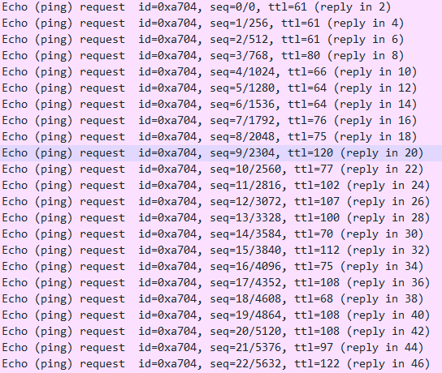

# sample-Network-200pt

[sample.pcap](sample.pcap)

これも競技中は解けなかったもの

`request`に注目してみると



`Ping`標準の`TTL`の長さの`64`でも`128`でもないので、なんか怪しい・・・

並べてみた

`[61,61,61,80,66,64,64,76,75,120,77,102,107,100,70,112,75,108,68,108,108,97,122]`

なんかASCIIコードっぽいな～

スクリプト書いてみよう

```python
#!/usr/bin/env python

arr = [61,61,61,80,66,64,64,76,75,120,77,102,107,100,70,112,75,108,68,108,108,97,122]
string = ""
for i in arr:
	string += chr(i)
print(string)
```

```plane
$ ./q11.py
===PB@@LKxMfkdFpKlDllaz
```

なんか違いそう・・・

う～んずらしたりするのかな？

```python
#!/usr/bin/env python

arr = [61,61,61,80,66,64,64,76,75,120,77,102,107,100,70,112,75,108,68,108,108,97,122]
string = ""
for i in range(1,20):
	for ch in arr:
		string += chr(ch+i)
	print(string)
	string = ""
	for ch in arr:
		string += chr(ch-i)
	print(string)
	string = ""
```

```plane
$ ./q11.py
>>>QCAAMLyNgleGqLmEmmb{
<<<OA??KJwLejcEoJkCkk`y
???RDBBNMzOhmfHrMnFnnc|
;;;N@>>JIvKdibDnIjBjj_x
@@@SECCON{PingIsNoGood}
:::M?==IHuJchaCmHiAii^w
AAATFDDPO|QjohJtOpHppe~
999L><<HGtIbg`BlGh@hh]v
BBBUGEEQP}RkpiKuPqIqqf
888K=;;GFsHaf_AkFg?gg\u
CCCVHFFRQ~SlqjLvQrJrrg�
777J<::FErG`e^@jEf>ff[t
DDDWIGGSRTmrkMwRsKssh�
666I;99EDqF_d]?iDe=eeZs
EEEXJHHTS�UnslNxStLtti�
555H:88DCpE^c\>hCd<ddYr
FFFYKIIUT�VotmOyTuMuuj�
444G977CBoD]b[=gBc;ccXq
GGGZLJJVU�WpunPzUvNvvk�
333F866BAnC\aZ<fAb:bbWp
HHH[MKKWV�XqvoQ{VwOwwl�
222E755A@mB[`Y;e@a9aaVo
III\NLLXW�YrwpR|WxPxxm�
111D644@?lAZ_X:d?`8``Un
JJJ]OMMYX�ZsxqS}XyQyyn�
000C533?>k@Y^W9c>_7__Tm
KKK^PNNZY�[tyrT~YzRzzo�
///B422>=j?X]V8b=^6^^Sl
LLL_QOO[Z�\uzsUZ{S{{p�
...A311=<i>W\U7a<]5]]Rk
MMM`RPP\[�]v{tV�[|T||q�
---@200<;h=V[T6`;\4\\Qj
NNNaSQQ]\�^w|uW�\}U}}r�
,,,?1//;:g<UZS5_:[3[[Pi
OOObTRR^]�_x}vX�]~V~~s�
+++>0..:9f;TYR4^9Z2ZZOh
PPPcUSS_^�`y~wY�^Wt�
***=/--98e:SXQ3]8Y1YYNg
```

あった！！

`SECCON{PingIsNoGood}`