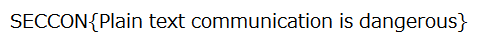

# [Network-200pt] get the flag

## Question

[ftp.zip](ftp.zip)

## Answer

```plane
220 (vsFTPd 3.0.3)
USER seccon2016
331 Please specify the password.
PASS kyoto=butiful
530 Login incorrect.
SYST
530 Please login with USER and PASS.
USER seccon2016
331 Please specify the password.
PASS kyoto=beautiful
230 Login successful.
SYST
215 UNIX Type: L8
PORT 10,100,4,123,174,34
200 PORT command successful. Consider using PASV.
LIST
150 Here comes the directory listing.
226 Directory send OK.
QUIT
221 Goodbye.
```

こんな感じでFTPは平文でパスワードが流れる・・・

実際に、FTPでアクセスしてログインする

```plane
-r--r--r--    1 0        0            2264 Nov 08 20:44 flag.zip
```

とのことなので、

flag.zipをダウンロードする

