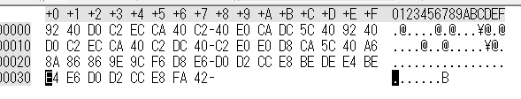

# [Programming-100pt] x2.txt

## Question

```plane
2倍になって文字化けしてしまったので、半分にしてみよう。
```

[x2.txt](x2.txt)

## Answer

バイナリエディタで開いてみた



おそらくASCIIコードを２倍にしたんだな～

スクリプトを書いてみる

[q14.py](q14.py)

```python
#!/usr/bin/env python

f = open("x2.txt","rb")

print "".join(map(lambda x:chr(ord(x) / 2),list(f.read())))

f.close()
```

```plane
$ ./q14.py
I have a pen. I have an apple. SECCON{lshift_or_rshift}!
```

流石に草

`SECCON{lshift_or_rshift}`
