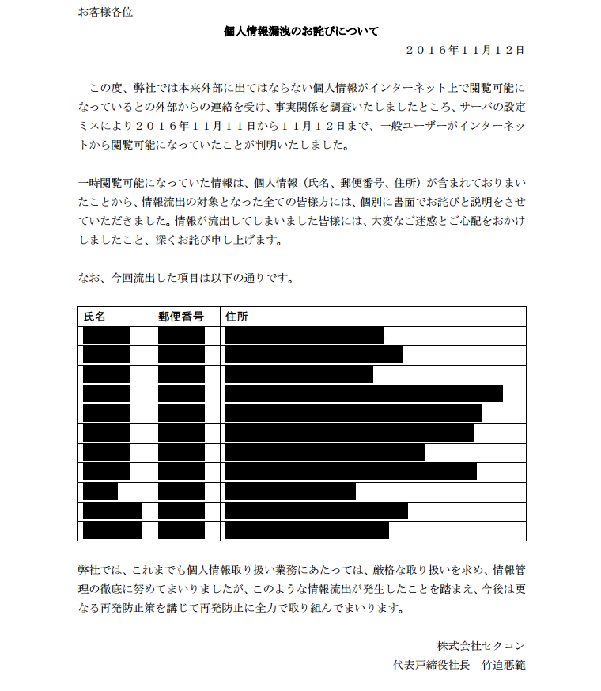

# [Trivia-100pt] blacked out PDF

## Question

```plane
個人情報漏洩のお詫びのPDFファイルの中から隠されたフラグを見つけよう
```

[owabi1.pdf](owabi1.pdf)

## Answer



黒塗りされているがコピーできてしまう

```plane
お客様各位
個人情報漏洩のお詫びについて
２０１６年１１月１２日
この度、弊社では本来外部に出てはならない個人情報がインターネット上で閲覧可能に
なっているとの外部からの連絡を受け、事実関係を調査いたしましたところ、サーバの設定
ミスにより２０１６年１１月１１日から１１月１２日まで、一般ユーザーがインターネッ
トから閲覧可能になっていたことが判明いたしました。
一時閲覧可能になっていた情報は、個人情報（氏名、郵便番号、住所）が含まれておりまい
たことから、情報流出の対象となった全ての皆様方には、個別に書面でお詫びと説明をさせ
ていただきました。情報が流出してしまいました皆様には、大変なご迷惑とご心配をおかけ
しましたこと、深くお詫び申し上げます。
なお、今回流出した項目は以下の通りです。
氏名 郵便番号 住所
坂田胡桃 769-2906 香川県東かがわ市川股 1-11-14
森下隆吾 922-0126 石川県加賀市山中温泉河鹿町 4-15
橋口清美 329-2337 栃木県塩谷郡塩谷町泉 1-6-2
笠井竹男 770-0832 徳島県徳島市寺島本町東 4-5 寺島本町東マンション 406
加賀真里 894-2403 鹿児島県大島郡瀬戸内町実久 2-1 実久スイート 304
飯島果凛 880-0927 宮崎県宮崎市源藤町 3-16-13 ガーデン源藤町 404
横溝常吉 210-0836 神奈川県川崎市川崎区大島上町 2-19-3
藤岡伊吹 899-5307 鹿児島県姶良郡蒲生町久末 1-20-2 久末タワー302
今野貞 871-0151 大分県中津市大悟法 1-18
平本由美子 922-0864 石川県加賀市大聖寺西栄町 1-19-11
↑偽物情報 111-1111 SECCON{kuronuri_ha_dame_zettai}
弊社では、これまでも個人情報取り扱い業務にあたっては、厳格な取り扱いを求め、情報管
理の徹底に努めてまいりましたが、このような情報流出が発生したことを踏まえ、今後は更
なる再発防止策を講じて再発防止に全力で取り組んでまいります。
株式会社セクコン
代表戸締役社長 竹迫悪範
```

黒塗りは絶対だめ

`SECCON{kuronuri_ha_dame_zettai}`