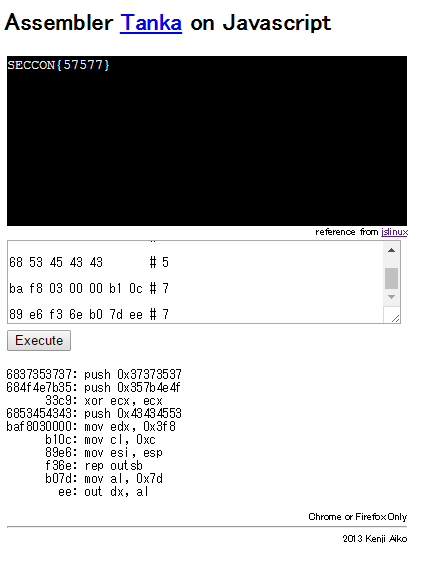

# [Binary-100pt] Assembler Tanka

## Question

```plane
「アセンブラ短歌」は五・七・五・七・七の三十一バイト(みそひとバイト)から成る機械語コードでプログラムを書いてみるという近未来の文化的趣味であり，近年，国内のハッカー間で密かなブームが起きています．


問題：以下のアセンブラ短歌を実行せよ


68 37 35 37 37       # 5

68 4f 4e 7b 35 33 c9 # 7

68 53 45 43 43       # 5

ba f8 03 00 00 b1 0c # 7

89 e6 f3 6e b0 7d ee # 7


参考：ディスアセンブルの結果は以下の通り。


6837353737: push 0x37373537

684f4e7b35: push 0x357b4e4f

      33c9: xor ecx, ecx

6853454343: push 0x43434553

baf8030000: mov edx, 0x3f8

      b10c: mov cl, 0xc

      89e6: mov esi, esp

      f36e: rep outsb

      b07d: mov al, 0x7d

        ee: out dx, al


ヒント：実行環境がない場合は、JavaScriptでアセンブラ短歌の実行をエミュレートするサイトがあるので探してみましょう。


-- 以下，アセンブラ短歌のホームページより引用 --


アセンブラに関する知識はセキュリティの根本を理解する上で重要であり，セキュリティ教育の一貫としてアセンブラ学習が見直されています．しかしアセンブラ・リーディング／コーディングは空洞化してしまった技術分野でもあり，学習機会の不足や独学の困難さも問題視されています．このような状況の中，半分遊びの感覚で気軽にアセンブラを学習する方法として考え出されたのが「アセンブラ短歌」です．

アセンブラ短歌には， 31バイトの限られた機械語コードでプログラミングする，５・７・５・７・７の決められた位置で区切られるようにプログラミングする，決まったバイトパターンを(韻を踏むために)決まった位置に埋め込む，あえて特定の命令を使って(もしくは使わずに)プログラミングする，といった技術が必要になります．これらのことが，どのように役に立つのでしょうか？

攻撃から守るためには，まずはどのような攻撃があり得るのか，攻撃手法を理解することは避けて通れません．攻撃方法を知らなければ，防御はできません．

そしてバッファオーバーランの脆弱性攻撃によって送り込まれるいわゆる「シェルコード」には，被攻撃側のチェックを回避するために， NUL文字や空白文字を使わない機械語コードでプログラミングする，表示可能文字のみでプログラミングする，決められたサイズでプログラミングする，といった技法が使われます．

そのような攻撃から「守る」ためには，シェルコードの解析と理解が必要です．アセンブラ短歌を修得することはそのような解析技術や，対策を考えるための基礎知識に繋がるという目的があります．

```

## Answer

アセンブラ短歌の実行できるサイトがあるそうなので、やってみる

[http://07c00.com/asmtanka_on_js/](http://07c00.com/asmtanka_on_js/)

やってみた



できた

`SECCON{57577}`